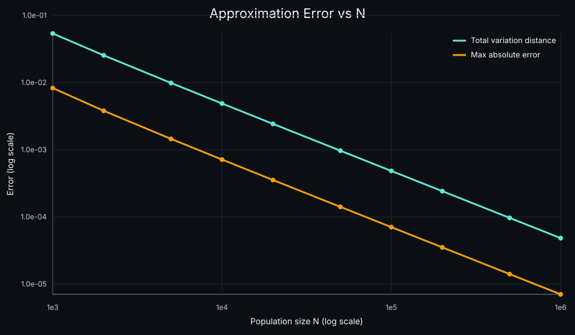
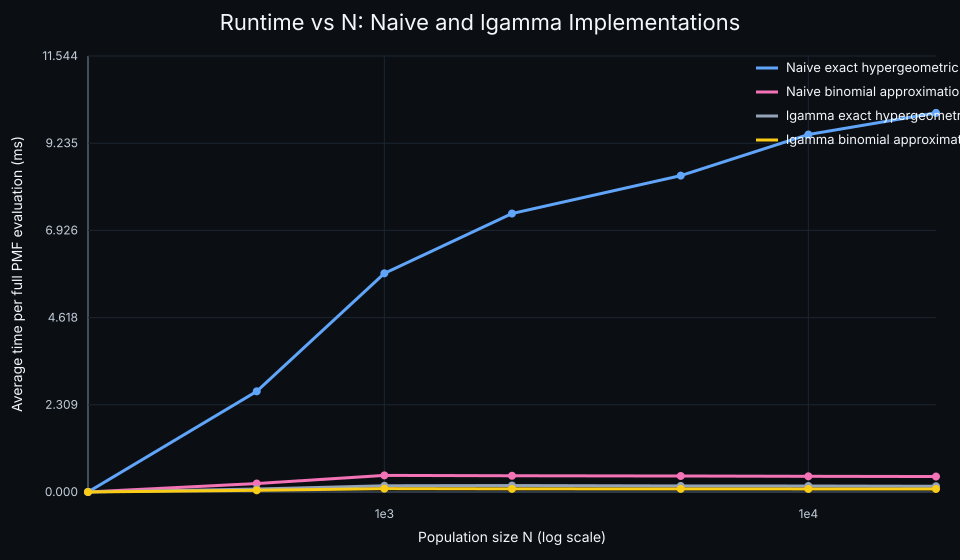

# Optimize Performance with Asymptotic Approximation

When people talk about performance optimization, they usually mean choosing a better algorithm or a better data structure. Another common approach is to use an approximation algorithm that trades some accuracy for speed.

There is a third category that is easy to overlook: asymptotic approximation. In the right regime, an asymptotic formula can be both faster to compute and accurate enough for practical use. In many cases, the approximation even gets better as the input grows.

This only works when the mathematics supports it, but when it does, it can be a very practical optimization technique.

## A Concrete Example

Suppose we want to plot the probability mass function of a hypergeometric distribution. Its exact formula is

$$
P(X = k) = \frac{\binom{K}{k}\binom{N-K}{n-k}}{\binom{N}{n}}
$$

where:

- $N$ is the population size
- $K$ is the number of successes in the population
- $n$ is the sample size
- $k$ is the number of observed successes

If $N$ is very large and the success ratio $p = \dfrac{K}{N}$ stays roughly fixed, then the hypergeometric distribution approaches a binomial distribution:

$$
P(X = k) \approx \binom{n}{k} p^k (1-p)^{n-k}
$$

This approximation is especially good when the sampling fraction $n/N$ is small. Intuitively, sampling without replacement starts to look like sampling with replacement when the population is huge.

From an implementation perspective, the binomial form is much cheaper to evaluate. The exact hypergeometric formula involves several large combinatorial terms, which usually means more expensive arithmetic or calls into special-function libraries. The binomial approximation replaces that with a simpler closed form and lower constant-factor cost.

Strictly speaking, this is not the same kind of optimization as changing the asymptotic time complexity of an algorithm. The speedup comes from replacing an expensive exact computation with a simpler formula that is valid for the input regime we care about.

The key trade-off is no longer "exact versus approximate" in the abstract. It becomes "is the approximation error small enough for this workload?" If the answer is yes, then the simpler formula may be the right engineering choice.

## Benchmarking the Two Approaches

To make the comparison meaningful, it helps to separate two questions:

1. How much faster is the approximation?
2. How quickly does the approximation error shrink as $N$ grows?

For the performance benchmark, the fairest comparison is a naive exact implementation against a naive asymptotic implementation. Otherwise, we risk comparing "plain arithmetic" on one side with "already optimized special functions" on the other.

I also kept `lgamma`-based versions in the benchmark as a second reference point. That matters because once we switch to `lgamma`, we are no longer benchmarking only the raw formulas. We are delegating part of the work to a numerically optimized special-function implementation, which may already incorporate approximation techniques internally.

For production code, a well-tested library such as SciPy is still usually the safer choice for the exact distribution. A practical workflow is:

1. Use a library implementation as the accuracy reference.
2. Use naive or minimally optimized implementations when you want to isolate the mathematical simplification itself.
3. Compare against `lgamma`-based or library implementations if you want to understand how much optimization is already happening under the hood.
4. Switch to the asymptotic approximation only after verifying the error is acceptable for your parameter range.

At the implementation level, the core comparison is just between the exact hypergeometric PMF and the binomial approximation:

```python
from math import comb

def hypergeom_pmf_naive(k: int, N: int, K: int, n: int) -> float:
    numerator = comb(K, k) * comb(N - K, n - k)
    denominator = comb(N, n)
    return numerator / denominator

def binom_pmf_naive(k: int, n: int, p: float) -> float:
    return comb(n, k) * (p**k) * ((1 - p) ** (n - k))
```

The full benchmark script also measures total variation distance and runtime across a range of $N$ values, but those two PMF functions are the essence of the comparison.






## Reading the Plots

The error plot is the main mathematical result. It shows that the approximation becomes steadily more accurate as $N$ grows, which is exactly the asymptotic behavior we expect. I used total variation distance as the main summary because it compares the full distributions rather than a single value of $k$.

The runtime plot now has two layers. The naive curves compare exact hypergeometric evaluation against the naive binomial approximation, which is the cleanest way to expose the benefit of the asymptotic simplification itself. In that comparison, the approximation is meaningfully faster.

The `lgamma` curves tell a different story. Once both formulas are rewritten in terms of `lgamma`, much of the combinatorial difficulty has already been absorbed into a fast special-function implementation. At that point the performance gap shrinks, because the exact computation has already been heavily optimized. Put differently, switching to `lgamma` is already a form of mathematical optimization, and likely relies on approximation methods internally rather than naive integer combinatorics.

Taken together, the two plots support a more precise message. The asymptotic approximation clearly improves with larger $N$, and it can also produce a large runtime win when compared to a more direct exact computation. But some of that advantage may disappear if your math library has already optimized the exact formula aggressively under the hood.

## Conclusions

Asymptotic approximation is a useful optimization tool when three conditions hold:

1. The approximation is mathematically justified for your input range.
2. The simplified formula is materially cheaper to compute.
3. The approximation error is acceptable for the application.

The hypergeometric-to-binomial example is a good illustration. For large populations, the approximation is easy to justify, cheap to evaluate, and often accurate enough to use directly in visualization or simulation code.

The main lesson is that performance work is not only about algorithms and hardware. Sometimes the biggest gain comes from stepping back and asking whether the exact formula is necessary at all.

## References

1. https://math.stackexchange.com/questions/330553/proof-that-the-hypergeometric-distribution-with-large-n-approaches-the-binomia

2. https://math.stackexchange.com/questions/2881821/asymptotic-behavior-of-combinations-approximating-hypergeometric-by-binomial?noredirect=1&lq=1
